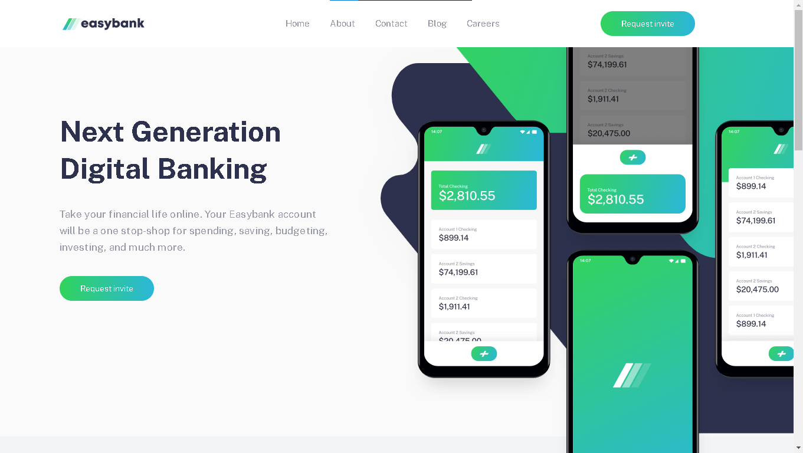
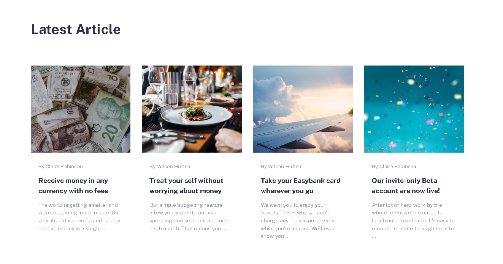
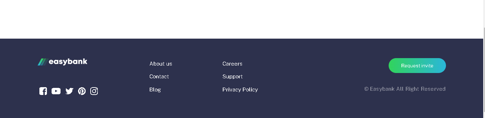

# EasyBank Advertisement Website



## 📌 Overview
This project is a professional advertisement website for EasyBanks, built using **HTML, CSS, and JavaScript**. It provides an elegant and modern design to showcase EasyBanking services, promotions, and offers in an attractive way.

## 🚀 Features
- **Responsive Design** 📱: Optimized for all devices (desktop, tablet, mobile)
- **Interactive UI** 🎨: Engaging animations and user-friendly experience
- **Bank Listings** 🏦: Showcase multiple EasyBanks with their services
- **SEO Friendly** 🔍: Optimized for search engines
- **Fast Performance** ⚡: Lightweight and optimized for speed

## 📸 Screenshots
### Home Page


### EasyBank Listings


### Contact Page


## 🛠️ Technologies Used
- **HTML5** 🎯: Structuring the content
- **CSS3** 🎨: Styling and animations
- **JavaScript** ⚙️: Dynamic interactions

## 📂 Installation
1. Clone the repository:
   ```bash
   git clone https://github.com/LechehebDjaafar/EasyBank
   ```
2. Open the project folder:
   ```bash
   cd EasyBank
   ```
3. Run the website by opening `index.html` in your browser.

## 🌍 Live Demo
Check out the live version: [Demo Link](https://lechehebdjaafar.github.io/EasyBank/)

## 📧 Contact
For any inquiries or collaboration, reach out to me:
- Linkdin: [@Lecheheb Djaafar](https://www.linkedin.com/in/lecheheb-djaafar-226594348/)

---
⭐ **If you like this project, don't forget to give it a star!** ⭐
